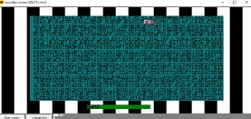
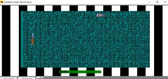
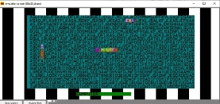
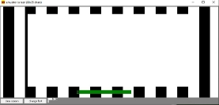
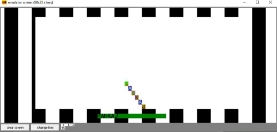
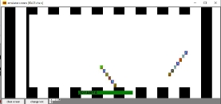
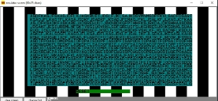

# WORD-GAME 

## Overview

In the "Word Hunt" project using emu8086, we aim to develop a dedicated platform that enhances the gaming experience of the popular word puzzle game, "Word Hunt." The platform will be designed to run on emu8086, a popular x86 microprocessor emulator. The project seeks to create an engaging and interactive environment for players to enjoy word hunting while exploring the capabilities of microprocessor technology.


# Design Goals/Objectives

The primary design goals and objectives of the "Word Hunt" project revolve around the development of an engaging and educational gaming experience. The project seeks to create a user-friendly environment that caters to players of all backgrounds and skill levels.

First of all the word hunt shows the display line by line in this word hunt, we will try making random word combinations.

To achieve this, we aim to implement efficient word recognition and searching algorithms, ensuring that the game play is both challenging and enjoyable. But in this word-hunt using the assembly language with push and pop operation is the vital rule of the game and other techniques.

We just designed the background color. But do not design the user interface. This interface will include features such as word highlighting, interactive grid navigation, and clear, user-friendly menus means here just use user input and find the keyword which included or not in the puzzles, making it easy for players to immerse themselves in the game.

In addition to these aspects, our project places a strong emphasis on fostering a sense
of when finding the word in the section it highlights and different colors. To make the
game accessible to a wide audience, we plan to implement adaptive difficulty levels.

This feature will ensure that both beginners and experienced players find the game
enjoyable, with an appropriate level of challenge that matches their skills and experience. Levels are such as EASY and HARD and also add RESET OPTION.

Beyond providing an exceptional gaming experience, this project serves as a practical demonstration of technical proficiency within the emu8086 environment. It showcases how innovation and cutting-edge technology can be applied to a retro platform,
pushing the boundaries of what can be achieved.


# Design/Development/Implementation of the Project

## Project Details

Design Section:

 Emu8086 Platform Adaptation


Figure 2.1: 8086 Emulator

The "Word Hunt" project aims to adapt the classic word puzzle game to the emu8086 platform, a vintage x86 microprocessor emulator. This adaptation presents a unique. challenge and opportunity, showcasing the versatility of microprocessor technology. The implementation includes designing the game logic, user interface, and interactions specifically tailored for emu8086.

# Implementation

In this section, we provide a detailed overview of the implementation process, covering the workflow, tools and libraries used, and specific implementation details.

## The workflow

The workflow of the project involves designing the game logic, user interface, and interactions. It includes the development of word recognition algorithms, random word generation, and adaptive difficulty levels. The implementation follows a systematic process to ensure a cohesive and engaging gaming experience.

## Tools and libraries

he implementation utilizes emu8086 as the primary tool for emulating the x86 microprocessor. Assembly language is employed to write the code, incorporating low-level
instructions for efficient execution. The project may leverage additional tools and libraries for specific functionalities, such as user interface design and graphical elements.

Implementation details (with screenshots and programming codes) SOURCE CODE:


Figure2.2:


` `

Figure 2.3:

` `

 Figure 2.4:


Figure 2.5:


 Figure 2.6:


   Figure 2.7:


Figure 2.8: whole Emulator work

The core implementation details encompass the creation of background colors, word-hunt puzzles, cursor movements, and word recognition. The code provided initializes the game environment, sets background colors, and begins the process of drawing the word-hunt puzzle on the screen.


# Algorithms

In this section, we outline the key algorithms used in the project, providing a detailed explanation of each algorithm and its role in the overall functionality of the "Word Hunt" game.

Algorithm 1: Random Word Generation

Input: List of words Output: Randomly selected word Data: Word Hunt array

Select a random index from the list of words. Retrieve the word at the selected index. Populate the Word Hunt array with the characters of the chosen word. Algorithm 2: Word Recognition

Input: User-input search word Output: Highlighted word in the puzzle Data: Search array, Word Hunt array, cursor color

Receive user-input search words. Compare each character of the search word with the corresponding characters in the Word Hunt array. If a match is found, highlight the matched letters using cursor color. Implement logic for searching horizontally, vertically, and diagonally. Display the updated puzzle with highlighted letters. These algorithms contribute to the core functionalities of the game, enabling random word generation and efficient word recognition within the emu8086 environment.


# Results Analysis/Testing

In this section, we analyze the results obtained from the simulation, focusing on specific aspects of the game’s performance.

<a name="_page15_x89.86_y621.86"></a>3.2.1 Result\_portion\_1


Figure 3.1: Background Design


## Result\_portion\_2


Figure 3.2: WAITION USER INPUT AND EASY SECTION

## Result\_portion\_3


<a name="_page17_x89.86_y262.89"></a>Figure 3.3: FIND COMPUTER

## Result\_portion\_4



Figure 3.4: FIND GAME


## Result\_portion\_5



Figure 3.5: FIND WORK

## Result\_portion\_6


Figure 3.6: FIND COMPUTER

## Result\_portion\_7



Figure 3.7: HARD SECTION START


## Result\_portion\_8


Figure 3.8: FIND PANKAJ

##  Result\_portion\_9



Figure 3.9: FIND JOYARYA

## Result\_portion\_10



Figure 3.10: FINAL RESET AND GO EASY SECTION


21


# Discussion

In conclusion, the "Word Hunt" project successfully adapts the classic word puzzle game to the emu8086 platform, providing a nostalgic and engaging gaming experience. The implementation includes efficient word recognition algorithms, background color alternation, and interactive user interfaces tailored for emu8086


# References

1. [Visit and Find Large Information from this site.](https://www.github.com)

   2. [Visit this Blog.](https://dev.to/xlmriosx/introduction-with-examples-to-emu8086-54lh)
   2. [Visit Electronicsforyou.](https://electronicsforyou.in/assembly-language-programming/)
   2. [Visit Another Blog.](https://www.github.com/pan78m)

## How to run this Project
- Go  to Messenger/src/Chat  folder
- Find the server dot java file
- First of all run the server dot java file then 
- Run user1 and user2 
- But reminder that sometimes shows some error because you need to connect any local server. Then this error do not shows next time

- You can run same way for Group chatting Part in the project.


## You can find project proposal [.png>)](https://www.overleaf.com/read/dwyzdrdxjzyn#db232a)

## Code of Sources

To deploy this project run

```bash
  Messenger/src/Chat
```
```bash
  Group Chatting Application/src/group/chatting/application
```


## Social

[](https://www.youtube.com/@pan78mtricks)

[](https://www.facebook.com/pankaj.mahanto.78)

[](linkedin.com/in/pankaj-mahanto78/)

[](https://x.com/mahanto_pankaj?t=uSysV9y-QMHIzqo-PIL3sA&s=08)


## Authors

[.png>)](https://www.github.com/pankaj-arya)

[](https://www.google.com/gmail)
# You can find project report [.png>)](https://www.overleaf.com/read/zpwfrgbxnrmb#a0ee04)


